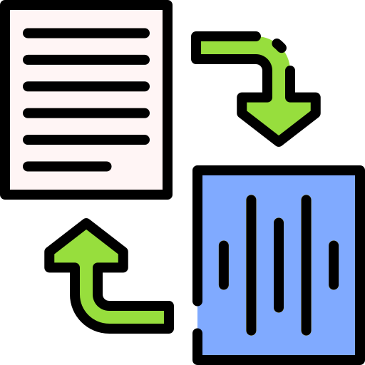

# octokonverter

  
    

## Converters

Available converters:

- `octoconf_to_addin_ti.py`: converts the octoconf csv output file to json following the format expected by the Addin-TI
- `octoconf_to_xlsx_to_ms_excel.py`: converts the octoconf xslx output file to Microsoft Excel xlsx file

## Copyright and license

Copyright (c) 2021 Nicolas GRELLETY

This software is licensed under GNU GPLv3 license. See `LICENSE` file in the root folder of the project.

Icons made by [Good Ware](https://www.flaticon.com/authors/good-ware "Good Ware") from [www.flaticon.com](https://www.flaticon.com/ "Flaticon")
